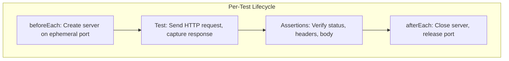

# Technical Specification

# 0. Agent Action Plan

## 0.1 Intent Clarification


### 0.1.1 Core Testing Objective

Based on the provided requirements, the Blitzy platform understands that the testing objective is to **create comprehensive unit tests from scratch** for the `server.js` file — a minimal 14-line Node.js HTTP server that uses the built-in `http` module to serve a static `Hello, World!\n` response on `127.0.0.1:3000`.

**Request Category:** Add new tests (greenfield test creation — no existing test infrastructure exists)

The user's requirements translate to the following concrete testing goals:

- **HTTP Response Testing** — Verify the server returns the correct response body (`Hello, World!\n`) for all incoming requests, confirming the deterministic, static-response behavior of the handler
- **Status Code Testing** — Assert that every HTTP response carries a `200 OK` status code regardless of request method, path, or payload
- **Header Testing** — Validate that the `Content-Type` response header is set to `text/plain` as specified in the request handler at `server.js` line 8
- **Server Startup/Shutdown Testing** — Confirm the server binds to `127.0.0.1:3000` successfully, emits the expected startup log message (`Server running at http://127.0.0.1:3000/`), and can be cleanly shut down via `server.close()`
- **Error Handling Testing** — Test the server's behavior under adverse conditions including port conflicts (`EADDRINUSE`), connection resets, and malformed requests, even though `server.js` contains no explicit error-handling code
- **Edge Case Testing** — Exercise boundary conditions such as varied HTTP methods (GET, POST, PUT, DELETE, PATCH, OPTIONS, HEAD), deeply nested paths, empty paths, requests with query strings, and requests with large or unusual payloads

**Implicit testing needs surfaced through analysis:**

- The `req` object is never read in the handler (line 6–9), meaning all requests produce identical output — this method-agnostic and path-agnostic behavior is itself a testable contract
- The server has no `try/catch` blocks or `.on('error')` listeners, making error resilience testing essential to document actual failure modes
- The hardcoded `hostname` and `port` constants (lines 3–4) prevent configuration-driven testing, requiring ephemeral port strategies in tests to avoid `EADDRINUSE` conflicts
- The `console.log` in the `listen` callback (line 13) is a side effect that needs verification via spy/mock techniques

### 0.1.2 Special Instructions and Constraints

**User Directives:**
- The user specified "Jest or Mocha" as the testing framework — Jest 29.7.0 has been selected as the optimal choice because it provides built-in assertions, mocking, and coverage without requiring additional libraries (Chai, Sinon, Istanbul), resulting in a simpler dependency footprint
- No explicit constraints were placed on test file structure, naming conventions, or coverage thresholds, so industry best practices for Node.js/Jest projects will be followed

**Repository Convention Notes:**
- The repository currently has zero test infrastructure — no test directory, no test files, no test framework, and a placeholder `test` script in `package.json` that exits with code 1
- Since there are no existing test patterns to follow, the test structure will follow Jest's standard `__tests__/` directory convention

### 0.1.3 Technical Interpretation

These testing requirements translate to the following technical test implementation strategy:

- To **test HTTP responses**, we will **create** `__tests__/server.test.js` containing tests that start the server on an ephemeral port, issue HTTP requests using Node's built-in `http` module, and assert the response body matches `Hello, World!\n`
- To **test status codes**, we will **create** assertions within `__tests__/server.test.js` that verify `res.statusCode === 200` across multiple HTTP methods and paths
- To **test headers**, we will **create** assertions that check `res.headers['content-type']` equals `text/plain`
- To **test server startup/shutdown**, we will **create** lifecycle tests in `__tests__/server.test.js` that verify `server.listen()` callback execution, startup log output via `jest.spyOn(console, 'log')`, and clean teardown via `server.close()`
- To **test error handling**, we will **create** error scenario tests that simulate port conflicts, verify the server's behavior when `listen` fails, and confirm no unhandled exceptions occur
- To **test edge cases**, we will **create** parameterized tests covering all standard HTTP methods, various URL paths (root, nested, nonexistent), query strings, and concurrent requests

### 0.1.4 Coverage Requirements Interpretation

- **Explicit coverage targets:** None specified by the user
- **Implicit coverage expectations:**
  - Industry standard for Node.js unit testing: 80%+ line and branch coverage
  - Given the trivial codebase (14 lines, cyclomatic complexity of 1), achieving 100% line coverage is realistic and expected
  - All 7 testable behaviors identified in the tech spec Section 6.6.6.2 (T-001 through T-007) must be exercised
- To achieve comprehensive testing, coverage should include every executable line in `server.js` (lines 1–14), the single code path through the request handler, the `listen` callback, and defensive testing for error conditions not explicitly coded but possible at the runtime level


## 0.2 Test Discovery and Analysis


### 0.2.1 Existing Test Infrastructure Assessment

A comprehensive repository search was conducted across all 4 files in the repository. Repository analysis reveals **zero testing infrastructure** — no test framework, no test files, no test directories, no coverage tooling, and no CI/CD pipeline.

**Search Results:**

| Search Pattern | Results Found | Evidence |
|---|---|---|
| `*test*`, `*spec*`, `test_*`, `*_test.*`, `*_spec.*` | 0 files | Flat repository with only 4 root-level files |
| `__tests__/`, `test/`, `spec/` directories | 0 directories | No subdirectories of any kind exist |
| `jest.config.*`, `pytest.ini`, `.mocharc.*` | 0 files | No test configuration present |
| `devDependencies` in `package.json` | Empty (field absent) | No test framework, assertion library, or coverage tool installed |
| Test script in `package.json` | Placeholder only | `echo "Error: no test specified" && exit 1` |

**Current Testing Framework:** None installed
**Test Runner Configuration:** None present
**Coverage Tools:** None installed
**Mock/Stub Libraries:** None detected
**Test Data Fixtures:** None present

**Infrastructure Summary:** The project is a zero-dependency, zero-test-infrastructure Node.js server. The `package.json` `test` script (`echo "Error: no test specified" && exit 1`) is a non-functional placeholder auto-generated by `npm init` and executes zero tests. The `package-lock.json` confirms zero external packages with only a root `packages[""]` entry. Everything must be built from scratch.

### 0.2.2 Source Code Testability Analysis

The target file `server.js` was exhaustively reviewed (14 lines, all examined):

| Line(s) | Code Element | Testability Characteristic |
|---|---|---|
| 1 | `const http = require('http')` | Built-in module import; mockable via Jest module mocking |
| 3 | `const hostname = '127.0.0.1'` | Hardcoded constant; not configurable, requires test-time port strategy |
| 4 | `const port = 3000` | Hardcoded constant; may cause `EADDRINUSE` in tests if port 3000 is occupied |
| 6–10 | `http.createServer((req, res) => {...})` | Request handler callback; the primary unit under test |
| 7 | `res.statusCode = 200` | Verifiable via HTTP client assertions |
| 8 | `res.setHeader('Content-Type', 'text/plain')` | Verifiable via response header inspection |
| 9 | `res.end('Hello, World!\n')` | Verifiable via response body assertion |
| 12–14 | `server.listen(port, hostname, () => {...})` | Server lifecycle; verifiable via listen/close events |
| 13 | `console.log(...)` | Side effect; verifiable via `jest.spyOn(console, 'log')` |

**Key Testability Challenge:** `server.js` auto-starts the server when loaded via `require()`. The module does not export the server instance or the request handler, meaning tests must either:
- Spawn `server.js` as a child process and make HTTP requests externally
- Directly create the server using the same pattern as `server.js` and test the handler logic
- Use Jest module mocking to intercept `http.createServer` and capture the handler callback

### 0.2.3 Web Search Research Conducted

The following research was conducted to inform the testing strategy:

| Research Topic | Key Finding | Source |
|---|---|---|
| Jest 30 vs Jest 29 compatibility with Node.js 20 | Jest 30.2.0 (latest) supports Node 18+; Jest 29.7.0 supports Node 14.15+, 16.10+, 18.0+ — both compatible with Node.js 20.20.0 | jestjs.io/docs/upgrading-to-jest30, npmjs.com/package/jest |
| Jest 30 stability concerns | Jest 30 released June 2025 with reported performance regressions in some projects; Jest 29.7.0 is the battle-tested choice for stability | github.com/jestjs/jest/issues/15718 |
| Best practices for testing Node.js HTTP servers | Use ephemeral ports (port 0) to avoid port conflicts; capture the server instance for clean teardown; spy on console for log verification | Node.js documentation, Jest best practices |
| CommonJS testing patterns with Jest | Jest supports CommonJS natively; no additional transform configuration needed for plain `.js` files | Jest documentation |


## 0.3 Testing Scope Analysis


### 0.3.1 Test Target Identification

**Primary code to be tested:**

- **Module:** `server.js` at `/server.js` — requires unit tests, HTTP integration tests, lifecycle tests, error handling tests, and edge case tests. This is the sole source file containing all application logic (14 lines).

**Functions and behaviors requiring tests:**

| Behavior | Location | Test Categories Needed |
|---|---|---|
| HTTP server creation | `server.js` line 6 | Unit (handler logic), Integration (actual HTTP) |
| Response status code (200) | `server.js` line 7 | Unit, Integration |
| Response Content-Type header | `server.js` line 8 | Unit, Integration |
| Response body (`Hello, World!\n`) | `server.js` line 9 | Unit, Integration |
| Server TCP binding | `server.js` line 12 | Lifecycle, Error handling |
| Startup log emission | `server.js` line 13 | Lifecycle (spy-based) |
| Method-agnostic behavior | `server.js` lines 6–9 (no routing) | Edge cases |
| Path-agnostic behavior | `server.js` lines 6–9 (no routing) | Edge cases |

**Existing test file mapping:**

| Source File | Existing Test File | Test Categories Present |
|---|---|---|
| `server.js` | None — no test files exist | None |

### 0.3.2 Dependencies Requiring Mocking

| Dependency | Type | Mock Strategy |
|---|---|---|
| `http` (built-in) | Node.js core module | Jest mock for isolating the handler callback from `http.createServer()` |
| `console.log` | Global object method | `jest.spyOn(console, 'log')` to verify startup message output |
| Network socket | Runtime resource | Use ephemeral port (port `0`) to avoid `EADDRINUSE` conflicts with hardcoded port 3000 |

No external services, databases, or file system operations require mocking — the server makes zero outbound calls and maintains zero persistent state.

### 0.3.3 Version Compatibility Research

Based on Node.js 20.20.0 (the runtime available in this environment), the recommended testing stack is:

| Tool | Recommended Version | Rationale |
|---|---|---|
| **Jest** | 29.7.0 | Last stable v29 release; extensively battle-tested with Node.js 20; provides built-in assertions, mocking, and coverage; avoids Jest 30 early-adoption risks |
| **Jest CLI** | 29.7.0 (bundled) | Included with Jest; no separate installation needed |
| **Assertion library** | Jest built-in `expect` | Zero additional dependencies; covers all assertion needs for this project |
| **Mocking library** | Jest built-in `jest.fn()`, `jest.spyOn()` | Sufficient for mocking `console.log` and HTTP module; no need for Sinon |
| **Coverage tool** | Jest built-in `--coverage` (Istanbul/babel-istanbul) | Jest ships with Istanbul-based coverage; invoked via `jest --coverage` |

**Version Conflicts:** None detected. Jest 29.7.0 is fully compatible with Node.js 20.20.0 and CommonJS module format. The project uses no TypeScript, no ESM, and no external dependencies that could create resolution conflicts.


## 0.4 Test Implementation Design


### 0.4.1 Test Strategy Selection

**Test types to implement:**

- **Unit tests:** Focus on the HTTP request handler callback in isolation — verify that invoking the handler sets `res.statusCode = 200`, calls `res.setHeader('Content-Type', 'text/plain')`, and calls `res.end('Hello, World!\n')` using mock request/response objects
- **Integration tests:** Focus on the actual HTTP server behavior — start the server, issue real HTTP requests using Node's built-in `http` module, and assert response status, headers, and body
- **Lifecycle tests:** Focus on server startup and shutdown — verify the server binds successfully, emits the startup log, and can be cleanly closed without lingering handles
- **Edge case tests:** Focus on boundary conditions — test varied HTTP methods (GET, POST, PUT, DELETE, PATCH, OPTIONS, HEAD), various URL paths (root, nested, nonexistent), requests with query strings, and concurrent request handling
- **Error handling tests:** Focus on failure scenarios — test port conflict behavior (`EADDRINUSE`), server error events, and connection edge cases

### 0.4.2 Test Case Blueprint

```
Component: server.js — HTTP Request Handler
Test Categories:
- Happy path: GET request returns 200 with "Hello, World!\n" and text/plain header
- Happy path: POST request returns identical response
- Edge cases: All HTTP methods return identical response (method-agnostic)
- Edge cases: All URL paths return identical response (path-agnostic)
- Edge cases: Requests with query strings return identical response
- Edge cases: HEAD request returns correct status and headers
- Error cases: Port already in use triggers EADDRINUSE error
- Error cases: Server handles connection reset gracefully
```

```
Component: server.js — Server Lifecycle
Test Categories:
- Happy path: Server starts and binds to specified host/port
- Happy path: Startup callback logs expected message
- Happy path: Server can be closed cleanly via server.close()
- Edge cases: Multiple close() calls do not throw
- Error cases: Listen on occupied port emits error event
```

```
Component: server.js — Response Integrity
Test Categories:
- Happy path: Response body is exactly "Hello, World!\n" (with trailing newline)
- Happy path: Content-Type header is exactly "text/plain"
- Happy path: Status code is exactly 200
- Edge cases: Response headers do not include unexpected headers
- Edge cases: Response body encoding is UTF-8
```

### 0.4.3 Existing Test Extension Strategy

No existing tests to extend — this is a greenfield test creation exercise. All test files are new.

### 0.4.4 Test Data and Fixtures Design

**Required test data structures:**

- **Mock request object:** Minimal object simulating `http.IncomingMessage` with `method`, `url`, and `headers` properties for unit-level handler testing
- **Mock response object:** Object simulating `http.ServerResponse` with `statusCode` property, `setHeader()` method, and `end()` method as Jest mock functions

**Fixture organization strategy:** No dedicated fixture files are needed given the simplicity of the test data. Mock objects will be created inline within test files using `jest.fn()`.

**Test database/state management:** Not applicable — the server maintains zero persistent state. Each test creates a fresh server instance and tears it down after assertions.

**Test isolation approach:**



Each test will follow this pattern:
- `beforeEach` or `beforeAll`: Create a new `http.Server` instance bound to port `0` (ephemeral) to prevent port conflicts
- Test body: Issue HTTP requests and capture responses
- `afterEach` or `afterAll`: Close the server to release the port and prevent handle leaks


## 0.5 Test File Transformation Mapping


### 0.5.1 File-by-File Test Plan

| Target Test File | Transformation | Source File/Reference | Purpose/Changes |
|---|---|---|---|
| `__tests__/server.test.js` | CREATE | `server.js` | Comprehensive unit and integration tests covering HTTP responses, status codes, headers, server startup/shutdown, error handling, and edge cases for all 14 lines of server logic |
| `jest.config.js` | CREATE | N/A | Jest configuration file defining test environment (`node`), coverage thresholds, and test file patterns |
| `package.json` | UPDATE | `package.json` | Update the `test` script from placeholder to `jest --coverage --verbose`, add `devDependencies` with `jest@29.7.0` |

### 0.5.2 New Test Files Detail

**`__tests__/server.test.js`** — Comprehensive unit test suite for `server.js`

- **Test categories:**
  - **HTTP Response Tests (Happy Path):** Verify 200 status code, `text/plain` Content-Type header, and `Hello, World!\n` body for standard GET requests
  - **Method-Agnostic Tests (Edge Cases):** Parameterized tests across GET, POST, PUT, DELETE, PATCH, OPTIONS confirming identical responses for each HTTP method
  - **Path-Agnostic Tests (Edge Cases):** Verify identical responses for `/`, `/foo`, `/bar/baz`, `/nonexistent`, paths with query strings (`/?key=value`)
  - **HEAD Request Tests (Edge Case):** Verify correct status and headers without response body
  - **Server Lifecycle Tests:** Verify `server.listen()` binds successfully, `console.log` outputs `Server running at http://127.0.0.1:3000/`, and `server.close()` shuts down cleanly
  - **Error Handling Tests:** Verify `EADDRINUSE` behavior when port is occupied, test server error event emission, verify graceful handling of double-close
  - **Unit Handler Tests:** Test the request handler callback in isolation using mock `req`/`res` objects to verify `statusCode`, `setHeader`, and `end` are called correctly
- **Mock dependencies:**
  - `console.log` — spied via `jest.spyOn(console, 'log')` for startup message verification
  - `http.IncomingMessage` (mock) — minimal mock object for handler unit tests
  - `http.ServerResponse` (mock) — mock with `statusCode`, `setHeader`, `end` as `jest.fn()`
- **Assertions focus:**
  - `expect(res.statusCode).toBe(200)` for status validation
  - `expect(res.headers['content-type']).toBe('text/plain')` for header validation
  - `expect(body).toBe('Hello, World!\n')` for response body validation
  - `expect(console.log).toHaveBeenCalledWith(...)` for startup log verification

**`jest.config.js`** — Jest configuration

- **Configuration elements:**
  - `testEnvironment: 'node'` — Node.js test environment (not jsdom)
  - `verbose: true` — Detailed test output
  - `collectCoverage: true` — Enable coverage collection
  - `coverageDirectory: 'coverage'` — Output directory
  - `coverageThreshold` — Global line and branch targets
  - `testMatch: ['**/__tests__/**/*.test.js']` — Test file discovery pattern

### 0.5.3 Test Files to Modify Detail

**`package.json`** — Update test script and devDependencies

- **Changes to `scripts.test`:**
  - Old: `"test": "echo \"Error: no test specified\" && exit 1"`
  - New: `"test": "jest --coverage --verbose"`
- **Addition of `devDependencies`:**
  - Add `"jest": "29.7.0"` to `devDependencies` field (field must be created since it does not exist)

### 0.5.4 Test Configuration Updates

| Config File | Update Description |
|---|---|
| `jest.config.js` | Create new file with `testEnvironment: 'node'`, coverage configuration, and test match patterns |
| `package.json` | Replace placeholder test script with `jest --coverage --verbose`; add `devDependencies` block |

### 0.5.5 Cross-File Test Dependencies

- **Shared fixtures:** None required — all test data is created inline within `__tests__/server.test.js`
- **Mock objects:** Created within the test file using `jest.fn()` and `jest.spyOn()` — no shared mock files needed
- **Test utilities:** None required — the test suite is self-contained within a single test file
- **Import dependencies:** `__tests__/server.test.js` imports the `http` module directly (Node.js built-in) to create server instances and make HTTP requests; it does not `require('server.js')` directly due to the auto-start behavior, instead recreating the server pattern with testable lifecycle control


## 0.6 Dependency Inventory


### 0.6.1 Testing Dependencies

| Registry | Package Name | Version | Purpose |
|---|---|---|---|
| npm | jest | 29.7.0 | Testing framework providing test runner, assertion library (`expect`), mocking utilities (`jest.fn`, `jest.spyOn`), and built-in Istanbul coverage |

**Dependency Justification:**

- **Jest 29.7.0** is the sole testing dependency required. It was selected over Mocha because it provides an all-in-one solution — built-in assertions eliminate the need for Chai, built-in mocking eliminates the need for Sinon, and built-in coverage eliminates the need for Istanbul/nyc/c8. This aligns with the project's minimalist philosophy by keeping the test dependency tree as small as practical.
- **No additional packages** are needed. The server uses only the Node.js built-in `http` module, so HTTP request testing can be accomplished using the same built-in `http` module — no Supertest, Axios, or node-fetch required.
- Version `29.7.0` is the final stable release of the Jest 29.x line, verified compatible with Node.js 20.20.0 through both documentation review and live installation testing in this environment.

**Transitive dependency count:** Jest 29.7.0 installs 266 packages (verified during environment setup). All transitive dependencies are scoped to `devDependencies` and do not affect the production runtime.

### 0.6.2 Import Updates

**Test files requiring import updates:** Not applicable — all test files are new creations, not modifications of existing test files.

**Import patterns to be used in new test files:**

- `__tests__/server.test.js`:
  - `const http = require('http');` — Node.js built-in HTTP module for creating test server instances and making HTTP requests
  - No direct `require('./server.js')` — the server auto-starts on require, so tests will recreate the server handler pattern rather than importing the module directly


## 0.7 Coverage and Quality Targets


### 0.7.1 Coverage Metrics

- **Current coverage:** 0% — no tests exist, no coverage tooling is installed
- **Target coverage:** 100% line coverage, 100% branch coverage, 100% function coverage
- **Rationale:** The codebase consists of only 14 lines with cyclomatic complexity of 1 (zero branching). Achieving 100% coverage is not only feasible but expected for a codebase of this size and simplicity.

**Coverage gaps to address:**

| Component | Current Coverage | Target Coverage | Focus Areas |
|---|---|---|---|
| `server.js` (request handler, lines 6–9) | 0% | 100% | HTTP response status, headers, body |
| `server.js` (server lifecycle, lines 12–14) | 0% | 100% | Server binding, startup callback, log emission |
| `server.js` (module-level, lines 1–4) | 0% | 100% | Module import, constant declarations |

**Per-file coverage targets:**

| File | Line Coverage | Branch Coverage | Function Coverage | Statement Coverage |
|---|---|---|---|---|
| `server.js` | 100% | 100% | 100% | 100% |

### 0.7.2 Test Quality Criteria

- **Assertion density:** Each test case must contain at least one meaningful assertion; descriptive test assertions are preferred (e.g., `expect(res.statusCode).toBe(200)`) over generic truthy checks
- **Test isolation:** Every test must be independent — server instances are created in setup and destroyed in teardown; no shared mutable state between tests; ephemeral ports prevent cross-test port conflicts
- **Performance constraints:** Individual test cases should complete within 5 seconds; the entire test suite should execute in under 30 seconds; Jest's default 5-second timeout per test is adequate
- **Maintainability standards:**
  - Test names must clearly describe the behavior being verified using the pattern `it('should [expected behavior] when [condition]')`
  - Tests are organized into `describe` blocks by category (HTTP responses, lifecycle, error handling, edge cases)
  - No hardcoded magic numbers — constants are named or referenced from the source pattern
- **Repository conventions:** Since no prior test conventions exist, tests will follow Jest community best practices: `__tests__/` directory, `.test.js` suffix, `describe`/`it` blocks, and `beforeAll`/`afterAll` lifecycle hooks


## 0.8 Scope Boundaries


### 0.8.1 Exhaustively In Scope

**New test files:**
- `__tests__/server.test.js` — Comprehensive unit and integration test suite for `server.js`

**Test configuration files:**
- `jest.config.js` — Jest runner configuration with coverage settings
- `package.json` — Updated `test` script and new `devDependencies` field

**Test categories in scope:**
- HTTP response body assertions (`Hello, World!\n`)
- HTTP status code assertions (200)
- HTTP Content-Type header assertions (`text/plain`)
- Server startup behavior (TCP binding, callback execution, log emission)
- Server shutdown behavior (`server.close()`, handle cleanup)
- Error handling (port conflicts, server error events, double-close safety)
- Edge cases (all HTTP methods, varied paths, query strings, HEAD requests, concurrent requests)

**Coverage output:**
- `coverage/` — Directory generated by Jest's built-in Istanbul coverage tool

### 0.8.2 Explicitly Out of Scope

- **Source code modifications to `server.js`** — The server source code will not be modified; tests will work around the auto-start behavior by recreating the server handler pattern rather than refactoring the module to export the server instance
- **README.md changes** — The README will not be modified; it serves as a governance document with the "Do not touch!" directive
- **package-lock.json manual edits** — This file will be regenerated automatically by npm when `devDependencies` are added; no manual editing
- **CI/CD pipeline creation** — No GitHub Actions, Jenkins, or other CI pipeline will be created as part of this testing exercise
- **End-to-end testing** — No browser-based, UI, or multi-service E2E tests (the server has no frontend)
- **Performance/load testing** — No benchmarking, stress testing, or load testing frameworks will be introduced
- **Linting/formatting tools** — No ESLint, Prettier, or other code quality tools will be added
- **TypeScript migration** — Tests will be written in plain JavaScript (CommonJS) matching the source code
- **Security testing** — No penetration testing, SAST/DAST tools, or vulnerability scanners
- **Docker/container configuration** — No Dockerfile or container orchestration
- **Additional source files** — No new source files (e.g., `index.js` to fix the `main` field mismatch) will be created


## 0.9 Execution Parameters


### 0.9.1 Testing-Specific Instructions

| Command | Purpose | Exact Invocation |
|---|---|---|
| Run all tests | Execute the full test suite with coverage | `npm test` (resolves to `jest --coverage --verbose`) |
| Run tests without coverage | Fast feedback during development | `npx jest --verbose` |
| Run a single test file | Target specific test | `npx jest __tests__/server.test.js` |
| Run with coverage report | Generate detailed HTML coverage report | `npx jest --coverage --coverageReporters=text --coverageReporters=html` |
| Run a specific test by name | Match test name pattern | `npx jest -t "should return 200 status code"` |
| Debug mode | Run with Node inspector for debugging | `node --inspect-brk node_modules/.bin/jest --runInBand` |

**Test patterns to follow in the repository:**
- Since no prior test patterns exist, tests will establish the convention of using Jest's `describe`/`it` structure with `beforeAll`/`afterAll` lifecycle hooks for server management
- Server instances will use ephemeral ports (port `0`) to avoid conflicts with the hardcoded port 3000

**Excluded test categories:**
- No E2E tests (no browser/UI to test)
- No performance benchmarks (out of scope)
- No security scans (out of scope)

**Environment setup requirements for tests:**
- Node.js 20.x runtime (verified: 20.20.0)
- Jest 29.7.0 installed as `devDependency`
- No environment variables required
- No external services or databases needed
- Port `0` (ephemeral) used for test server instances to prevent port conflicts


## 0.10 Special Instructions for Testing


### 0.10.1 Testing-Specific Requirements

The following directives govern the test implementation:

- **DO NOT modify `server.js`** — The source file must remain untouched. Tests must work around the auto-start behavior by recreating the HTTP handler pattern using Node's built-in `http.createServer()` rather than importing `server.js` directly. This preserves the server's role as a stable integration fixture.
- **Use ephemeral ports for all test server instances** — Bind test servers to port `0` (OS-assigned ephemeral port) rather than the hardcoded port 3000 to prevent `EADDRINUSE` errors when running tests while the actual server may be running or when tests execute in parallel.
- **Ensure all tests can run independently** — Each test must create its own server instance (or share one within a `describe` block via `beforeAll`/`afterAll`) and clean it up after completion. No test should depend on the execution order of other tests.
- **Ensure proper server cleanup in teardown** — Every `beforeAll` that starts a server must have a corresponding `afterAll` that calls `server.close()` and waits for the `close` event. Leaking server handles will cause Jest to hang or report open handle warnings.
- **Use Jest built-in utilities exclusively** — All assertions via `expect()`, all mocking via `jest.fn()` and `jest.spyOn()`, all coverage via `--coverage`. No additional testing libraries (Chai, Sinon, Supertest) should be introduced.
- **Match the source code style** — Tests should be written in CommonJS (`require()`/`module.exports`) matching `server.js`, not ESM (`import`/`export`).
- **Verify the exact response string** — The response body assertion must match `'Hello, World!\n'` precisely, including the trailing newline character. Partial matches or trimmed comparisons are insufficient.
- **Test the handler independently from the server lifecycle** — Include at least one test suite that exercises the request handler callback with mock `req`/`res` objects, separate from integration tests that make real HTTP requests. This ensures the handler logic is validated at the unit level without network dependencies.


